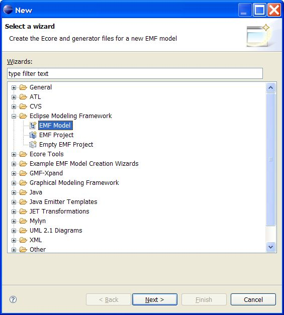
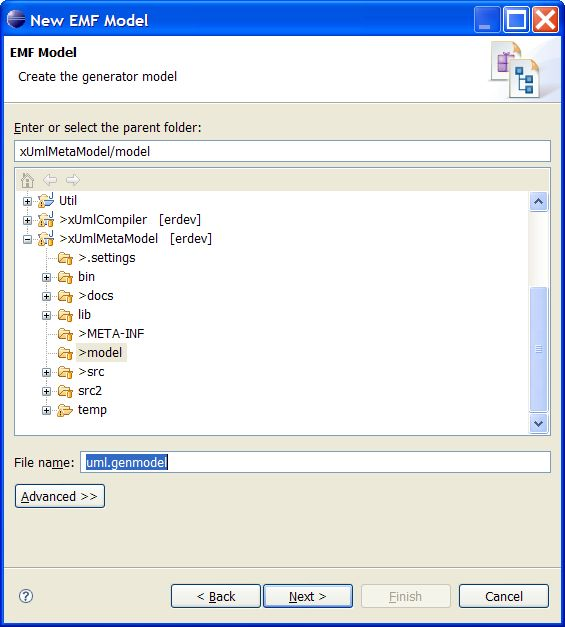
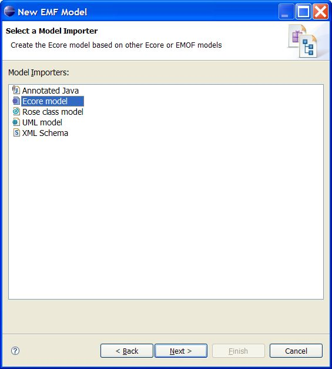
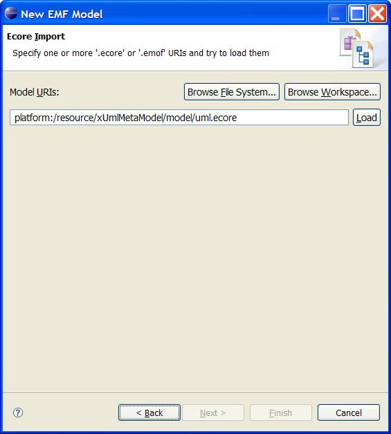
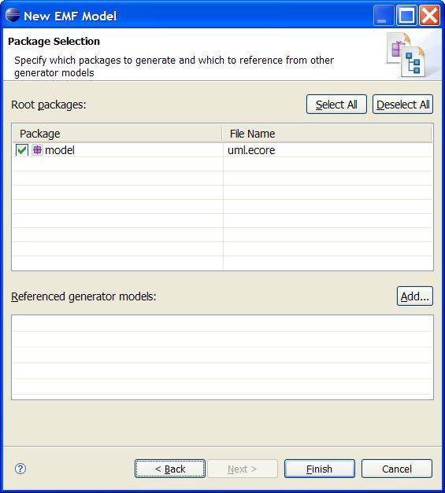

# xUmlMetaModel
## How to build this project
If you change the model/uml.ecore that is the underlying metamodel for the xUmlCompiler then you need to regenerate the source from this new ecore file.
This is what you do:

* Delete model/uml.genmodel
* Select model/uml.ecore in Package Explorer
* Click right mouse and select New - Other - Eclipse Modelling Framework - EMF Model

* Hit the Load button and the Next button will be enabled:

* Delete previously generated code:

* Generate the code (to the src folder):

