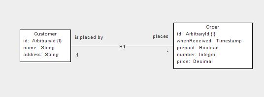
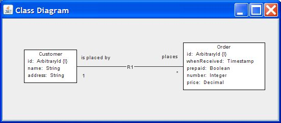
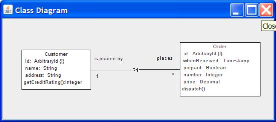
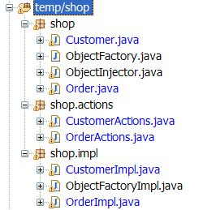
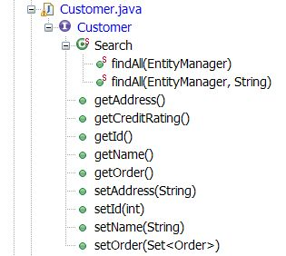

xUmlCompiler


## xUmlCompiler User's Guide
### Introduction
### Define a system
Consider this class diagram:



To define this system create this class:

```java
package moten.david.uml.xuml.model.example.order;

import java.io.IOException;

import model.Class;
import model.Primitive;
import moten.david.uml.xuml.model.Generator;
import moten.david.uml.xuml.model.Multiplicity;
import moten.david.uml.xuml.model.util.SystemBase;

public class Shop extends SystemBase {

    private static final String schema = "SHOP";
    private static final String systemName = "Shop";

    public Shop() {
        super(schema, systemName);
        initialize();
    }

    private void initialize() {
        model.Package pkg = createRootPackage("shop", "shop system");
        Class order = createClass(pkg, "Order", "a purchase order");
        createPrimaryKey(createAttribute(order, "id", Primitive.ARBITRARY_ID),
                Generator.GENERATED_VALUE);
        createAttribute(order, "whenReceived", Primitive.TIMESTAMP);
        createAttribute(order, "prepaid", Primitive.BOOLEAN);
        createAttribute(order, "number", Primitive.INTEGER);
        createAttribute(order, "price", Primitive.DECIMAL);

        Class customer = createClass(pkg, "Customer", "shop customer");
        createPrimaryKey(
                createAttribute(customer, "id", Primitive.ARBITRARY_ID),
                Generator.GENERATED_VALUE);
        createAttribute(customer, "name", Primitive.STRING);
        createAttribute(customer, "address", Primitive.STRING);
        createAssociation("R1", createAssociationEndPrimary(order,
                Multiplicity.MANY, "places"), createAssociationEndSecondary(
                customer, Multiplicity.ONE, "is placed by"));
    }

    public static void main(String[] args) throws NumberFormatException,
            IOException {
        Shop shop = new Shop();
        shop.view("Shop.ini");
    }

}
```

### View the system
Before you run the viewer you need to indicate where you are going to save the setttings for the view of the Shop system. The file is currently set to be _Shop.ini_ in the java working directory. Change it if you like.
To view the system, run the above class (the main method calls the viewer). You will need to reposition the elements but when you close the viewer the positions will be saved automatically. 
You may want to change the name of the location of the settings file in the main method.



### Add methods to the classes
Add this code to the end of the initialize() method: 

```java
createOperation(order, "dispatch", "dispatches the order", null, false);
    createOperation(
        customer,
        "getCreditRating",
        "gets the credit rating",
        "Integer", false);
```
 Run the viewer and we see the new operations in the classes.



### Generate the classes
xUmlCompiler generates

* entity classes with ejb3 annotations (and possible hibernate specific annotations)
* interfaces for all entities
* object factory classe
* injector classes for late binding of actions
 * search classes based on identifier and index specifications 
 * value enumerations for static constants associated with attributes
 
Paste in the following class:

```java
package moten.david.uml.xuml.model.example.shop;

public class ShopGenerator {

    public static void main(String[] args) throws Exception {
        Shop shop = new Shop();
        shop.generate("temp/shop");
    }
}
```

All classes will be written to the directory temp/shop. Change it if you wish. Create the directory if it does not exist.
Run the main method in the above class and classes will be generated as below:



Notice the getter and setter methods on the Customer interface class and the search methods. If we had defined identifiers (uniqueness rules other than the primary key id field) we would see finders for the identifier attribute groups as well.  



### Implement actions
All methods and state machine entry points should be implemented by your behaviour classes.

Here's the behaviour class for the Order class:
```java
package moten.david.uml.xuml.model.example.shop;

import shop.Order;
import shop.actions.OrderActions;

public class OrderBehaviour implements OrderActions {

    private Order order;

    @Override
    public void dispatch() {
        System.out.println("dispatching order " + order.getId());
    }

    @Override
    public void setOrder(Order order) {
        this.order = order;
    }

}
```
### Define an injector
```java
package moten.david.uml.xuml.model.example.shop;

import shop.actions.OrderActions;

import com.google.inject.AbstractModule;

public class ShopInjectorModule extends AbstractModule {

     @Override
     protected void configure() {
          bind(OrderActions.class).to(OrderBehaviour.class);
     }

}
```
### Execute the system
To execute the system we must first ensure that the generated objects use the shop InjectorModule for late bound injection of behaviour:
```java
package moten.david.uml.xuml.model.example.shop;

import shop.ObjectInjector;

import com.google.inject.Guice;

public class ShopLauncher {

    public static void main(String[] args) {
        // enable injection of actions
        ObjectInjector.setInjector(Guice
                .createInjector(new ShopInjectorModule()));
    }

}
```

